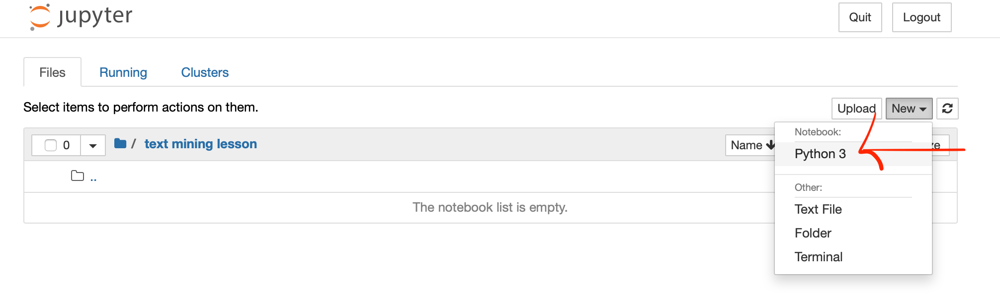

## Introduction to Jupyter Notebook

This course run is using [Jupyter Notebook](https://jupyter.org). It is an open-source web application that allows you to create and share documents that contain live code, equations, visualizations and narrative text.

### Starting Jupyter Notebook server
The start the lesson within a Jupyter Notebook you first need to start a Jupyter Notebook server.  To do that you need to open a terminal window and type:

~~~
jupyter notebook
~~~
{: .bash}

This should open up a browser window containing the base directory of where you can store your notebook on your computer.

You can learn how to open a terminal window on your computer in the setup instructions for this lesson.

### Creating a new notebook

To create a new notebook you need to select a location for it on your computer via the browser window that opened up and click on "New" in the top right corner of the browser.  You also need to select Python 3 to do so.



Once the new notebook opens you can give it a name by changing the word "Untitled" in the first line of the new notebook that opens up.


You can see the first cell in your new notebook.  You can enter python code into this cell and press "Run" as long as it is marked as "Code" in the menu at the top of your notebook.  This will run your code and you will see any output created by the code immediately below it.

This should be all you need for using a notebook in this lesson but more information on how to use Jupyter Notebook and how to store a notebook can be found in this Data Carpentries [Overview of Jupyter Notebook](https://datacarpentry.org/python-ecology-lesson/jupyter_notebooks/).

> ## Testing it works
>
> To check that it works, tell the notebook to print the string "Works!" by typing the following code into the cell:
>
> ~~~
> print("Works!")
> ~~~
> {: .source}
>
> and press run.  
>
> > ## Solution
> >
> > The output of your code appears below the cell.
> >
> >```
> > Works!
> >```
> > {: .output}
> {: .solution}
{: .challenge}



