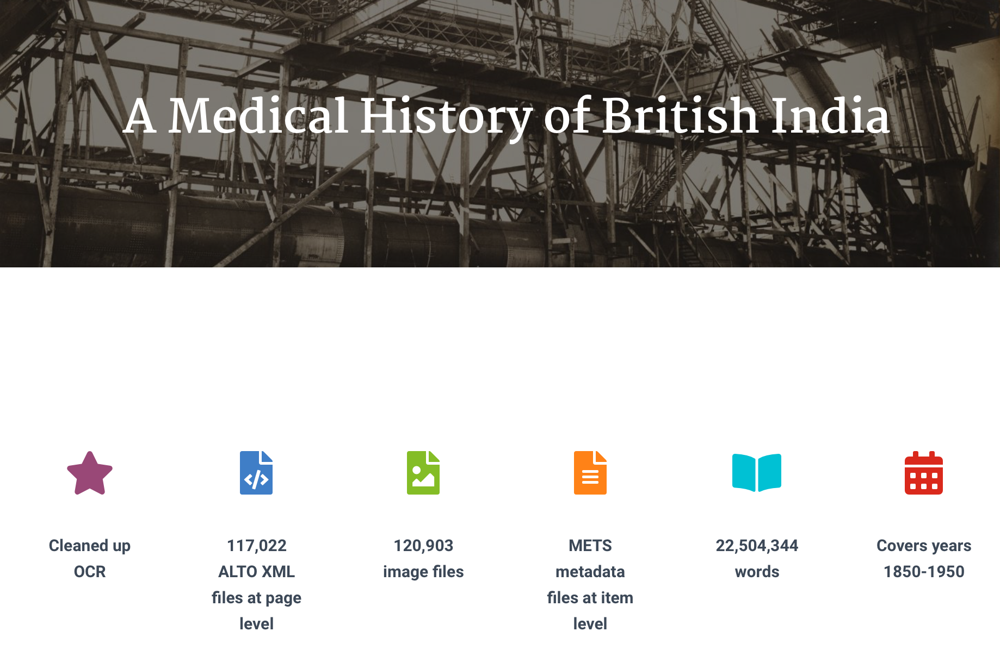

## Data Preparation

Text data comes in different forms.  You might want to analyse a document in one file or an entire collection of documents (a corpus) stored in multiple files.  In this part of the lesson, we will show you how to load a single document and how to load the text of an entire corpus into Python for further analysis.

### Download some data

Firstly, please download a dataset and make a note of where it is saved on your computer.  We need the path to dataset in order to load and read it for further processing.

We will use the [Medical History of British India](https://data.nls.uk/data/digitised-collections/a-medical-history-of-british-india/) collection provided by the [National Library of Scotland](https://www.nls.uk) as an example:



> This dataset forms the first half of the Medical History of British India collection, which itself is part of the broader India Papers collection held by the Library. A Medical History of British India consists of official publications varying from short reports to multi-volume histories related to disease, public health and medical research between circa 1850 to 1950. These are historical sources for a period which witnessed the transition from a humoral to a biochemical tradition, which was based on laboratorial science and document the important breakthroughs in bacteriology, parasitology and the developments of vaccines in a colonial context.

This collection has been made available as part of NLS's DataFoundry platform which provides access to a number of their digitised collections.

We are only interested in the text the Medical History of British India collection for this course so at the bottom of the website, download the "Just the text" data or download it directly [here](https://nlsfoundry.s3.amazonaws.com/text/nls-text-indiaPapers.zip).

Note that this dataset requires approx. 120 MB of free file space on your computer once it has been unzipped.  Most computers automatically uncompress ```.zip``` files as the one you have downloaded.  If your computer does not do that then right-click on the file and click on uncompress or unzip.

You should be left with a folder called ```nls-text-indiaPapers``` containing all the ```.txt``` files for this collection.  Please check that you have that on your computer and find out what its path is.  In my case it is ```/Users/balex/Downloads/nls-text-indiaPapers/```.

### Loading and tokenising a single document

You can use the ```open()``` function to open one file in the Medical History of British India corpus. You need to specify the path to a file in the downloaded dataset and the mode of opening it ('r' for read). The path will be different to the one below depending on where you saved the data on your computer.

The ```read()``` function is used to read the file. The file's content (the text) is then stored as a string variable called ```india_raw```.

You can then tokenise the text and convert it to lowercase. You can check it has worked by printing out a slice of the list ```lower_india_tokens```.

```python
file = open('/Users/balex/Downloads/nls-text-indiaPapers/74457530.txt','r')  # replace the path with the one on your computer
india_raw = file.read()
india_tokens = word_tokenize(india_raw)
lower_india_tokens = [word.lower() for word in india_tokens]
lower_india_tokens[0:10]
```
    ['no', '.', '1111', '(', 'sanitary', ')', ',', 'dated', 'ootacamund', ',']

### Loading and tokenising a corpus

We can do the same for an entire collection of documents (a corpus).  Here we choose a collection of raw text documents in a given directory.  We will use the entire Medical History of British India collection as our dataset.

To read the text files in this collection we can use the ```PlaintextCorpusReader``` class provided in the ```corpus``` package of NLTK.  You need to specify the collection directory name and a wildcard for which files to read in the directory (e.g., ```.*``` for all files) and the text encoding of the files (in this case ```latin1```).  Using the ```words()``` method provided by NLTK, the text is automatically tokenised and stored in a list of words. As before, we can then lowercase the words in the list.

```python
from nltk.corpus import PlaintextCorpusReader
corpus_root = '/Users/balex/Downloads/nls-text-indiaPapers/'
wordlists = PlaintextCorpusReader(corpus_root, '.*', encoding='latin1')
corpus_tokens = wordlists.words()
print(corpus_tokens[:10])
```
    ['No', '.', '1111', '(', 'Sanitary', '),', 'dated', 'Ootacamund', ',', 'the']


```python
lower_corpus_tokens = [str(word).lower() for word in corpus_tokens]
lower_corpus_tokens[0:10]
```

> ## Task 1: Print slice of tokens in list
>
> Print out a larger slice of the list of tokens in the Medical History of British India collection, e.g., the first 30 tokens.
>
> > ## Answer
> > ~~~python
> > print(corpus_tokens[:30])
> > ~~~
> >
> {: .solution}
{: .challenge}

> ## Task 2: Print slice of lowercase tokens in list
>
> Print out the same slice but for the lower-cased version.
>
> > ## Answer
> > ~~~python
> > print(lower_corpus_tokens[0:30])
> > ~~~
> >
> {: .solution}
{: .challenge}


