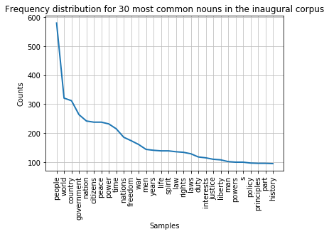

## Visualising Frequency distributions of tokens in text

#### Graph
The ```plot()``` method can be called to draw the frequency distribution as a graph for the most common tokens in the text.

```python
fdist.plot(30,title='Frequency distribution for 30 most common tokens in our text collection')

```


You can see that the distribution contains a lot of non-content words like "the", "of", "and" etc. (we call these stop words) and punctuation. We can remove them before drawing the graph.  We need to import ```stopwords``` from the ```corpus``` package to do this.  The list of stop words is combined with a list of punctuation and a list of single digits using ```+``` signs into a new list of items to be ignored.

```python
nltk.download('stopwords')
from nltk.corpus import stopwords
remove_these = set(stopwords.words('english') + list(string.punctuation) + list(string.digits))
filtered_text = [w for w in lower_india_tokens if not w in remove_these]
fdist_filtered = FreqDist(filtered_text)
fdist_filtered.plot(30,title='Frequency distribution for 30 most common tokens in our text collection (excluding stopwords and punctuation)')
```


> ## Note
> While it makes sense to remove stop words for this type of frequency analyis it essential to keep them in the data for other text analysis tasks.  Retaining the original text is crucial, for example, when deriving part-of-speech tags of a text or for recognising names in a text.  We will look at these types of text processing in day 2 of this course.
{: .callout}

#### Word Cloud
We can also present the filtered tokens as a word cloud. This allows us the have an overview of the corpus using the ```WordCloud( ).generate()``` method. The input to this method is a string and the whitespace in the string is used as the delimiter between words displayed in the word cloud.

We therefore have to join the filtered text back into a string, using the ```" ".join(list)``` syntax. This allows us to concatenate all of the items in the ```filtered_text``` list (so all of the lower-cased and filtered tokens in the corpus) by joining them into one string separating each list element (token) with a whitespace.

We generate the WordCloud on the concatenated string and plot the figure to a size. We can show the plot using plt.show()

```python
import matplotlib.pyplot as plt

from wordcloud import WordCloud
joined_text_string=' '.join(filtered_text)
cloud = WordCloud(max_font_size=80,colormap="hsv").generate(joined_text_string)
plt.figure(figsize=(16,12))
plt.imshow(cloud, interpolation='bilinear')
plt.axis('off')
plt.show()
```


__Task 7.2: Redraw the word cloud with the updated ```filtered_text``` variable (after removing the strings in task 7.1).__


> ## Task 1: Filter the frequency distribution further
>
> Change the last frequency distribution plot to not show any the following strings: "...", "1876", "1877", "one", "two", "three".
> Consider adding them to the ```remove_these``` list.
> Hint: You can create a list of strings of all numbers between 0 and 10000000 by calling ```list(map(str, range(0,1000000)))```
>
> > ## Answer
> >
> > ~~~python
> > numbers=list(map(str, range(0,1000000)))
> > otherTokens=["..."]
> > remove_these = set(stopwords.words('english') + list(string.punctuation) + numbers + otherTokens)
> > filtered_text = [w for w in lower_india_tokens if not w in remove_these_new]
> > fdist_filtered = FreqDist(filtered_text_new)
> > fdist_filtered.plot(30,title='Frequency distribution for 30 most common tokens in our text collection (excluding stopwords, punctuation, numbers etc.)')
> > ~~~
> > 
> {: .solution}
{: .challenge}

> ## Task 2: Redraw word cloud
>
> Redraw the word cloud with the updated ```filtered_text``` variable (after removing the strings in Task 1).
>
> > ## Answer
> >
> > ~~~python
> >
> > ~~~
> > 
> {: .solution}
{: .challenge}


