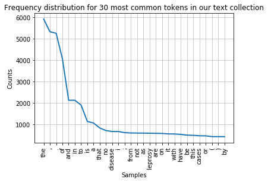
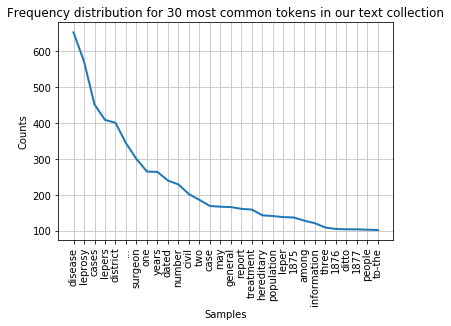
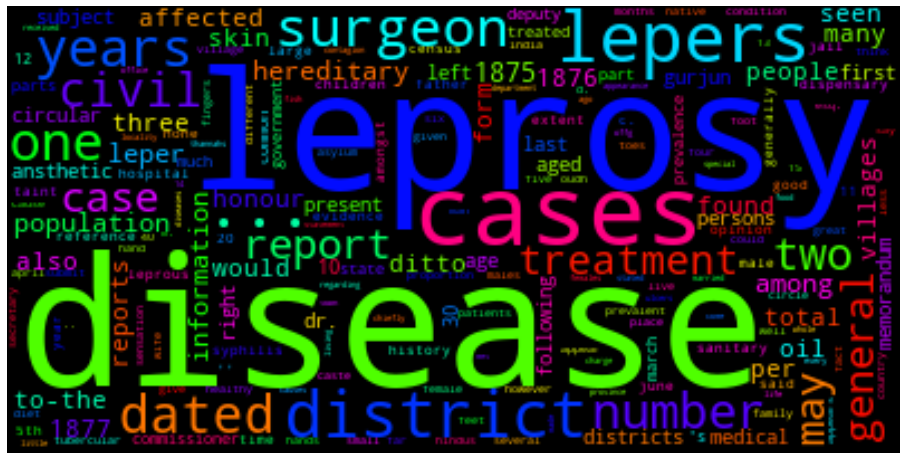
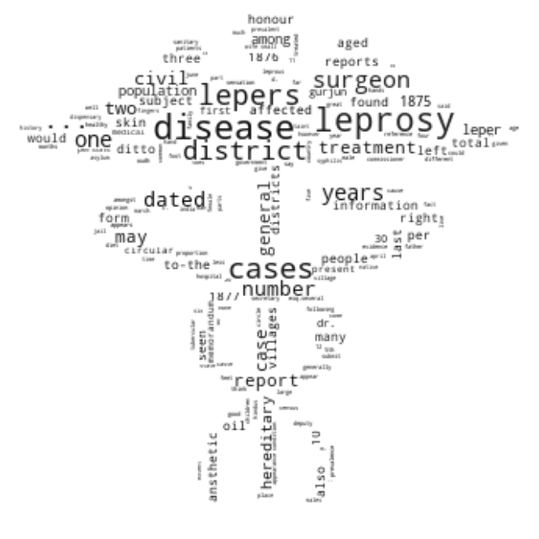
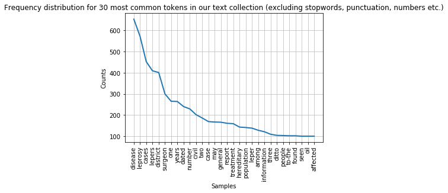
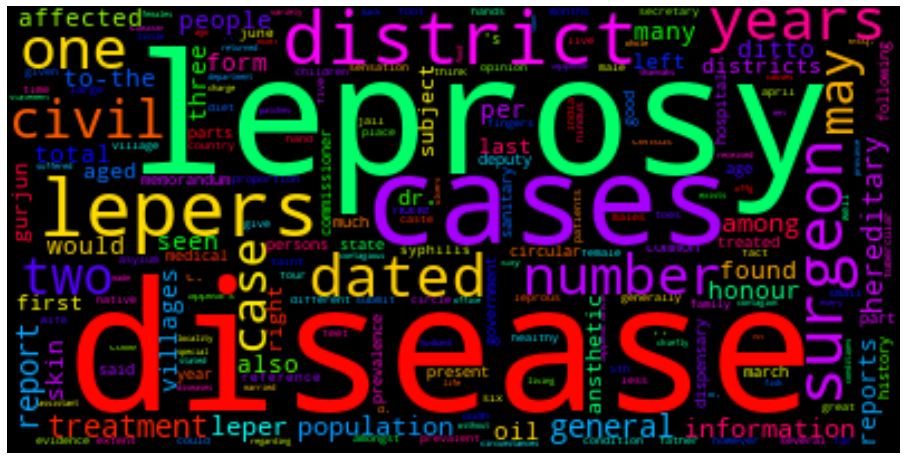

## Visualising Frequency distributions of tokens in text

#### Graph
The ```plot()``` method can be called to draw the frequency distribution as a graph for the most common tokens in the text.

```python
fdist.plot(30,title='Frequency distribution for 30 most common tokens in our text collection')

```


You can see that the distribution contains a lot of non-content words like "the", "of", "and" etc. (we call these stop words) and punctuation. We can remove them before drawing the graph.  We need to import ```stopwords``` from the ```corpus``` package to do this.  The list of stop words is combined with a list of punctuation and a list of single digits using ```+``` signs into a new list of items to be ignored.

```python
nltk.download('stopwords')
from nltk.corpus import stopwords
remove_these = set(stopwords.words('english') + list(string.punctuation) + list(string.digits))
filtered_text = [w for w in lower_india_tokens if not w in remove_these]
fdist_filtered = FreqDist(filtered_text)
fdist_filtered.plot(30,title='Frequency distribution for 30 most common tokens in our text collection (excluding stopwords and punctuation)')
```


> ## Note
> While it makes sense to remove stop words for this type of frequency analyis it essential to keep them in the data for other text analysis tasks.  Retaining the original text is crucial, for example, when deriving part-of-speech tags of a text or for recognising names in a text.  We will look at these types of text processing in day 2 of this course.
{: .callout}

#### Word cloud
We can also present the filtered tokens as a word cloud. This allows us the have an overview of the corpus using the ```WordCloud( ).generate_from_frequencies()``` method. The input to this method is a frequency dictionary of all tokens and their counts in the text.  This needs to be created first by importing the ```Counter``` package in python and creating a dictionary using the ```filtered_text``` variable as input.

We generate the WordCloud using the frequency dictionary and plot the figure to size. We can show the plot using ```plt.show()```.

```python
from collections import Counter
dictionary=Counter(filtered_text)
import matplotlib.pyplot as plt
from wordcloud import WordCloud

cloud = WordCloud(max_font_size=80,colormap="hsv").generate_from_frequencies(dictionary)
plt.figure(figsize=(16,12))
plt.imshow(cloud, interpolation='bilinear')
plt.axis('off')
plt.show()s
```
  

#### Shaped word cloud

And now a shaped word cloud for a bit of fun, if there is time at the end of day 1.  This will present your workcloud in the shape of a given image.

You need a shape file which we provide for you in the form of the medical symbol:


The mask image needs to have a transparent background so that only the black shape is used as a mask for the word cloud.

To display the shaped word cloud you need to import the ```Image``` package form ```PIL``` as well as ```numpy```.  The image first needs to be opened and converted into a numpy array which we call ```med_mask```.  A customised colour map (```cmap```) is created to present the words in black font.  Then the word cloud is created with a white background, the mask and the colour map set as parameters and generated from the dictionary containing the number of occurrences for each word.

```python
from PIL import Image
import numpy as np
med_mask = np.array(Image.open("medical.png"))

# Custom Colormap
from matplotlib.colors import LinearSegmentedColormap
colors = ["#000000", "#111111", "#101010", "#121212", "#212121", "#222222"]
cmap = LinearSegmentedColormap.from_list("mycmap", colors)

wc = WordCloud(background_color="white", mask=med_mask, colormap=cmap)
wc.generate_from_frequencies(dictionary)
plt.figure(figsize=(16,12))
plt.imshow(wc, interpolation="bilinear")
plt.axis("off")
```
   

> ## Task 1: Filter the frequency distribution further
>
> Change the last frequency distribution plot to not show any the following strings: "...", "1876", "1877", "one", "two", "three".
> Consider adding them to the ```remove_these``` list.
> Hint: You can create a list of strings of all numbers between 0 and 10000000 by calling ```list(map(str, range(0,1000000)))```
>
> > ## Answer
> >
> > ~~~python
> > numbers=list(map(str, range(0,1000000)))
> > otherTokens=["..."]
> > remove_these = set(stopwords.words('english') + list(string.punctuation) + numbers + otherTokens)
> > filtered_text_new = [w for w in lower_india_tokens if not w in remove_these]
> > fdist_filtered = FreqDist(filtered_text_new)
> > fdist_filtered.plot(30,title='Frequency distribution for 30 most common tokens in our text collection (excluding stopwords, punctuation, numbers etc.)')
> > ~~~
> > 
> {: .solution}
{: .challenge}


> ## Task 2: Redraw word cloud
>
> Redraw the word cloud with the updated ```filtered_text``` variable (after removing the strings in Task 1).
>
> > ## Answer
> >
> > ~~~python
> > dictionary=Counter(filtered_text)
> > import matplotlib.pyplot as plt
> > from wordcloud import WordCloud
> > cloud = WordCloud(max_font_size=80,colormap="hsv").generate_from_frequencies(dictionary)
> > plt.figure(figsize=(16,12))
> > plt.imshow(cloud, interpolation='bilinear')
> > plt.axis('off')
> > plt.show()
> > ~~~
> > 
> {: .solution}
{: .challenge}


